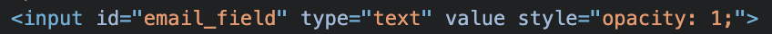

The `id` prop of the `react-multi-email` component is analogous to the `id` attribute in HTML. 
In web development, the `id` attribute is used to uniquely identify each HTML element. 
Within the same webpage, each `id` value should be distinct.

The `id` prop of the `react-multi-email` is used to set a unique identifier for the `input` element that the component renders.

import Id from '../../../src/examples/Id'

## About id

- Property: `id`
- Type: `string`
- Default: `''`

## Demo

<Id />

## Result



:::info
The `id` provided as a prop is added to the **input box**.
:::

## Code

### Whole code

```tsx title="id.tsx"
import * as React from 'react';
import { ReactMultiEmail } from 'react-multi-email';
import 'react-multi-email/dist/style.css';

export default function multiEmail() {
  const [emails, setEmails] = React.useState<string[]>([]);

  return (
    <div style={styles}>
      <h3>react-multi-email</h3>
      <ReactMultiEmail
        // id prop
        id="email_field"
        emails={emails}
        onChange={(_emails: string[]) => {
          setEmails(_emails);
        }}
        getLabel={(
          email: string,
          index: number,
          removeEmail: (index: number) => void
        ) => {
          return (
            <div data-tag key={index}>
              {email}
              <span data-tag-handle onClick={() => removeEmail(index)}>
                ×
              </span>
            </div>
          );
        }}
      />
      <h4>react-multi-email value</h4>
      <p>{emails.join(", ") || "empty"}</p>
    </div>
  );
}

const styles = {
  fontFamily: "sans-serif",
  width: "500px",
  border: "1px solid rgb(238, 238, 238)",
  background: "rgb(243, 243, 243)",
  padding: "25px",
  margin: "20px",
  color: "black",
};
```

### Specific code

```tsx title="id.tsx"
<ReactMultiEmail
  id="email_field"
/>
```
<br/><br/>

:::tip General usage
Within the ReactMultiEmail component, the `id` prop is typically used in the following scenarios:

1. **DOM Manipulation & Query**: In certain cases, you might need to directly manipulate or query a DOM element using JavaScript. In such scenarios, the `id` provides an easy way to access a specific element.
2. **Styling and Scripting**: Styling and Scripting: The `id` can be used to target a specific input element for applying CSS styles or JavaScript logic.
3. **Label Association**: Associating with Labels: By using the `id` value, an input field can be associated with a `label` element. This offers a user experience where clicking on the label will focus the corresponding input field.
:::