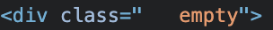

`noClass` prop is to determine whether to add the default provided class name `react-multi-email` to the top-level div of the component.<br/>

If `noClass` is set to `true`, the default class name `react-multi-email` won't be included. On the other hand, if `noClass` is `false` or **not set**, the `react-multi-email` class will be added to that `div` element.<br/>

This functionality exists so that you can opt out of the default styling of the react-multi-email component if they wish. By setting the noClass prop to true, **you can deactivate the default styling and apply their own custom styles.**


import NoClass from '../../../src/examples/NoClass'

## About noClass

- Property: `noClass`<br/>
- default: `false`<br/>
- type: `boolean` 

## Demo

<NoClass />

:::info
Open developer mode and check class name. There is a difference in style because the default class(`react-multi-email`) is not applied.<br/>
You can see that the class name is not specified in the picture below.
:::

## Result



:::tip
If the text area is empty, the `div` element will have the class name `empty`.
:::

## Code

### Whole code

```tsx title="noClass.tsx"
import * as React from 'react';
import { ReactMultiEmail } from 'react-multi-email';
import 'react-multi-email/dist/style.css';

export default function multiEmail () {
  const [emails, setEmails] = React.useState<string[]>([]);
  
  return (
    <div style={styles}>
      <h3>react-multi-email</h3>
      <ReactMultiEmail
        // noClass prop
        noClass={true}
        emails={emails}
        onChange={(_emails: string[]) => {
          setEmails(_emails);
        }}
        getLabel={(
          email: string,
          index: number,
          removeEmail: (index: number) => void
        ) => {
          return (
            <div data-tag key={index}>
              {email}
              <span data-tag-handle onClick={() => removeEmail(index)}>
                ×
              </span>
            </div>
          );
        }}
      />
      <h4>react-multi-email value</h4>
      <p>{emails.join(", ") || "empty"}</p>
    </div>
  );
}

const styles = {
  fontFamily: "sans-serif",
  width: "500px",
  border: "1px solid rgb(238, 238, 238)",
  background: "rgb(243, 243, 243)",
  padding: "25px",
  margin: "20px",
  color: "black",
};
```

### Specific code

```tsx title="onDisabled.tsx"
<ReactMultiEmail
  noClass={true}
/>
```